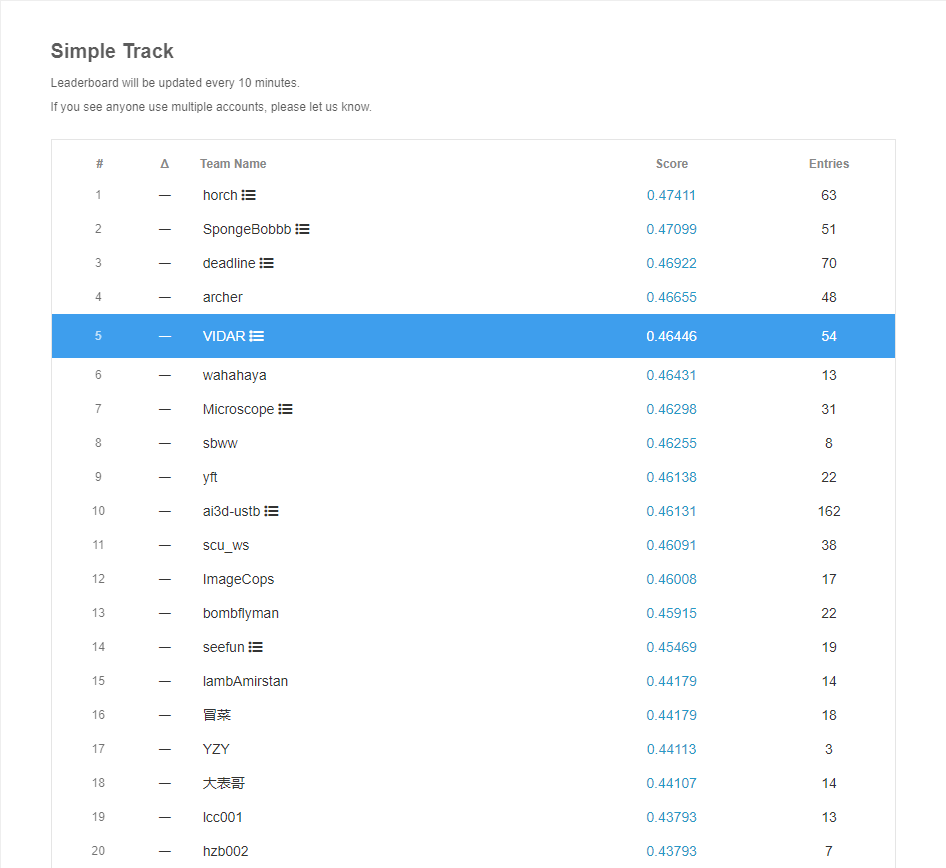
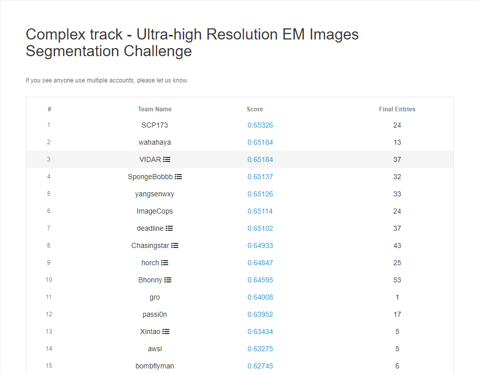
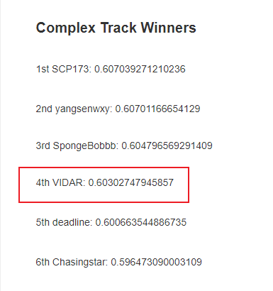
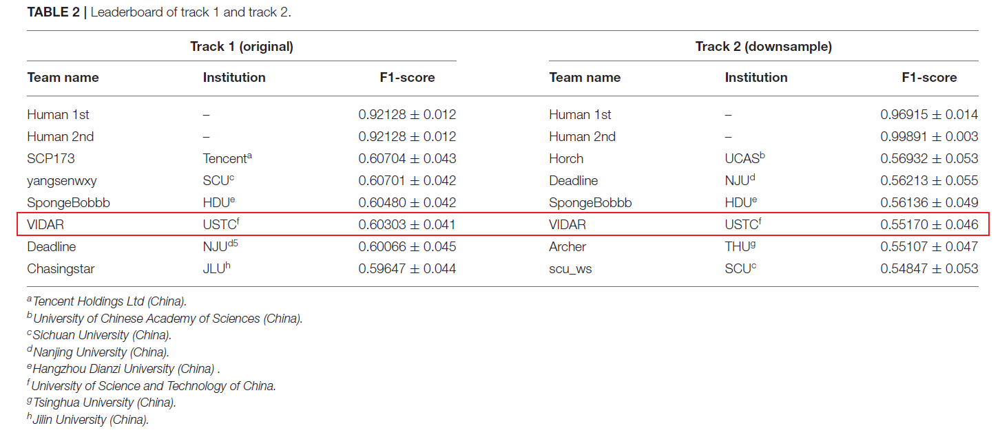

# U-RISC: Ultra-high Resolution EM Images Segmentation Challenge

Organizer's paper: [U-RISC: An Annotated Ultra-High-Resolution Electron Microscopy Dataset Challenging the Existing Deep Learning Algorithms](https://www.frontiersin.org/articles/10.3389/fncom.2022.842760/full)

Official website: [Ultra-high Resolution EM Images Segmentation Challenge](https://www.biendata.xyz/competition/urisc/)

Our solution (**4th**): [U-RISC 电镜图像神经元分割 第四名解决方案](https://blog.csdn.net/qq_33757398/article/details/104421986?ops_request_misc=%257B%2522request%255Fid%2522%253A%2522165415437516781432996346%2522%252C%2522scm%2522%253A%252220140713.130102334.pc%255Fblog.%2522%257D&request_id=165415437516781432996346&biz_id=0&utm_medium=distribute.pc_search_result.none-task-blog-2~blog~first_rank_ecpm_v1~rank_v31_ecpm-1-104421986-null-null.nonecase&utm_term=%E7%AC%AC%E5%9B%9B%E5%90%8D&spm=1018.2226.3001.4450)

## Simple Track

Preliminary leaderboard: **5/85 (VIDAR)**

Final leaderboard: **4th (VIDAR)**

## Complex Track

Preliminary leaderboard: **3/36 (VIDAR)**

Final leaderboard: **4th (VIDAR)**

## Paper results

